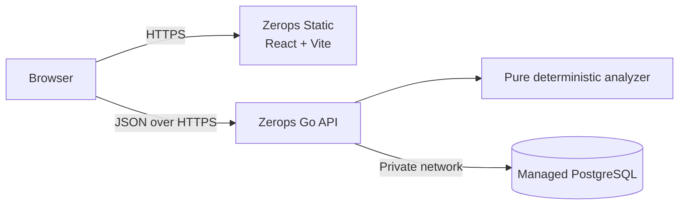

# TimeTrap

**Find the minute trust outlives truth.**

TimeTrap is a deterministic verifier that finds periods where dependent authorization state remains valid after its source authority has been revoked.

[Open TimeTrap](https://web-2b33.prg1.zerops.app) · [Unsafe example](https://web-2b33.prg1.zerops.app/results/d28ecf3d-e28a-4538-a74c-d88d791d57fe) · [Corrected example](https://web-2b33.prg1.zerops.app/results/1998c072-7095-4d5f-a45f-7a520a3d62c8) · [API health](https://api-2b33-8080.prg1.zerops.app/api/v1/health)

## The problem

Revoking a source authority does not necessarily invalidate every cached entitlement, session, or token derived from it. Independent expiration and refresh schedules create a measurable interval where stale access remains active—a timing flaw that conventional static checks can miss.

## What TimeTrap does

- Models source and dependent authorization objects on a bounded timeline.
- Accepts `issue`, `refresh`, `revoke`, and `expire` events at integer-minute boundaries.
- Evaluates three predefined temporal invariants with a pure Go analyzer.
- Generates and sorts only meaningful boundary candidates instead of checking every minute.
- Returns the earliest counterexample, exact half-open interval, evidence, and deterministic remediation.
- Persists scenario snapshots and analyses under durable, shareable result URLs.
- Applies supported corrections to a new scenario copy, preserving the original result.

## Try it

1. [Open TimeTrap](https://web-2b33.prg1.zerops.app).
2. Choose **Try subscription cancellation**.
3. Select **Save and analyze**.
4. Inspect the violation interval, timeline, evidence, and proposed correction.
5. Select **Apply fix and rerun** to create a corrected scenario and safe result.

See the [product tour](docs/product-tour.md) for a field-by-field walkthrough.

## Verified result

| Scenario | Result | Interval | Meaning |
| --- | --- | --- | --- |
| Original subscription cancellation | Unsafe | Stale `[10,60)`; violation `[15,60)` | Cached access remains active for 50 minutes after revocation and exceeds the five-minute grace by 45 minutes. |
| Corrected copy | Safe | No violation within 90 minutes | Revoking the cache at minute 10 removes the exposure while preserving the later expiry event. |

These are persisted server results, not frontend fixtures: [open the unsafe analysis](https://web-2b33.prg1.zerops.app/results/d28ecf3d-e28a-4538-a74c-d88d791d57fe) and [open the corrected analysis](https://web-2b33.prg1.zerops.app/results/1998c072-7095-4d5f-a45f-7a520a3d62c8).

## Architecture



The analyzer has no HTTP or database dependency. The API owns validation and orchestration; PostgreSQL stores scenario definitions and immutable analysis snapshots. See [architecture](docs/architecture.md).

## Technical highlights

- Pure, deterministic boundary-based analyzer with stable ordering.
- Exact earliest-counterexample selection and half-open intervals.
- Strict JSON decoding, bounded validation, and stable field paths.
- Safe structured errors, request IDs, panic recovery, and structured logs.
- PostgreSQL persistence with explicit forward migrations.
- Immutable historical snapshots and direct result retrieval by UUID.
- Typed React API client with cancellation, timeouts, and stage-aware retry.
- Responsive shared-scale timelines and machine-actionable remediation.

## Zerops deployment

The React/Vite production bundle is built and served by Zerops Static. A separate Zerops Go runtime hosts `/api/v1`; PostgreSQL is a private managed service with no public route. HTTPS routing exposes only the web and API services. Build-time API origin, runtime database reference, strict CORS origin, health probes, logs, and deployment verification are managed through Zerops and ZCP.

## Technology

Go · React · TypeScript · Vite · Tailwind CSS · PostgreSQL · Goose · Zerops · OpenAI Codex · ZCP

## Local quick start

Requirements: Go 1.25, Node.js 20.19+ or 22.12+, npm, PostgreSQL 16, and Goose v3.

```bash
cp .env.example .env
npm --prefix frontend ci
go -C backend test ./...
npm --prefix frontend run test
go -C backend run ./cmd/api
npm --prefix frontend run dev
```

Configure the ignored `.env` before starting the API or applying migrations. Full setup and safe migration commands are in [local development](docs/local-development.md).

## AI usage

OpenAI Codex assisted with planning, implementation, tests, documentation, deployment configuration, and verification. Generated work was reviewed through source inspection, automated tests, production builds, live API calls, and browser checks. See [AI usage](docs/ai-usage.md).

## Documentation

- [Product tour](docs/product-tour.md)
- [Architecture](docs/architecture.md)
- [Local development](docs/local-development.md)
- [API](docs/api.md)
- [Deployment](docs/deployment.md)
- [Testing](docs/testing.md)
- [AI usage](docs/ai-usage.md)
- [Limitations](docs/limitations.md)

## Limitations

- A result applies only to the submitted model and finite horizon.
- Time is modeled at integer-minute resolution using simplified valid/invalid object state.
- Public result UUIDs are shareable; the current product has no authentication or ownership controls.
- Remediation is limited to predefined deterministic operations and never changes production systems.

See [limitations](docs/limitations.md) for the complete boundary of the model.

## License

[MIT](LICENSE)
