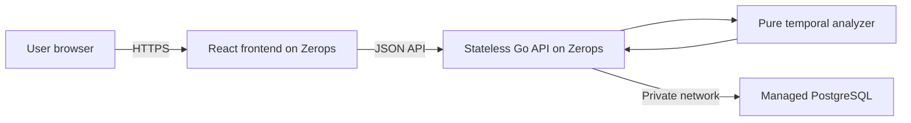

# TimeTrap architecture and frozen MVP scope

## Product definition

TimeTrap is a design-time verifier that finds intervals where cached entitlements, sessions, tokens, or other authorization copies remain valid after their source authorization has been revoked.

## Primary users

- Backend developers
- Authentication and identity developers
- SaaS engineering teams
- Subscription and entitlement-system developers
- Security reviewers

## Secondary users

- Students learning authorization architecture
- Technical interviewers and educators
- Teams reviewing cache and session policies

## Core product promise

TimeTrap turns a hidden timing disagreement into a deterministic counterexample containing:

- Exact violation start
- Exact violation end
- Duration
- Involved objects
- Responsible events
- Failed invariant
- Suggested configuration-level remediation

It verifies a submitted design model. It does not inspect a live application.

## Domain terminology

### Timed object

A simplified authorization-related object whose validity changes over time.

### Event

A state transition applied to one object at a particular integer minute.

### Source

The authoritative object from which another object's legitimacy is derived.

For example, a subscription record can be the source of a cached premium entitlement.

### Dependent

An object that should not remain valid beyond a rule-defined relationship with its source.

### Invariant

A condition expected to remain true throughout the submitted simulation horizon.

### Horizon

The final minute covered by the bounded analysis.

### Counterexample

The earliest reproducible interval during which an invariant fails.

## Supported objects

The MVP supports exactly these object kinds:

| Object | Intended use |
| --- | --- |
| Subscription | Billing or plan source of truth |
| Cached entitlement | Cached authorization or feature access |
| Session | Server-side or logical user session |
| Token | Access, refresh, reset or capability token |
| Invitation | Time-limited invitation |
| Credential | Temporary or revocable credential |

These kinds provide labels and validation context. The core reducer still operates on the same valid/invalid state model.

## Supported events

The MVP supports exactly these event types:

| Event | State effect |
| --- | --- |
| Issue | Makes the object valid |
| Refresh | Makes or keeps the object valid and resets its validity start |
| Revoke | Makes the object invalid |
| Expire | Makes the object invalid |

Every object begins invalid.

Contradictory events on the same object at the same minute are rejected. For example, an object cannot be both issued and revoked at minute 10.

## Temporal semantics

TimeTrap uses the following frozen rules:

1. Time is represented by non-negative integer minutes.
2. Events at minute `t` take effect at minute `t`.
3. Intervals use half-open notation: `[start, end)`.
4. The start of an interval is included.
5. The end of an interval is excluded.
6. An object issued at minute 0 and expired at minute 60 is valid during `[0, 60)`.
7. An object revoked at minute 10 is invalid beginning at minute 10.
8. Analysis makes claims only inside the configured horizon.
9. A violation that remains active at the horizon is reported as ongoing.
10. “Safe” means every configured invariant passed within the submitted model and horizon.

## Frozen invariants

The MVP supports exactly three invariant templates.

### 1. Revoked access must end within a grace period

Configuration:

- Source object
- Dependent object
- Grace duration

Meaning:

When the source is revoked at minute `r`, the dependent must no longer be valid beginning at `r + grace`.

Example:

- Source revoked at minute 10
- Grace duration is 5 minutes
- Dependent remains valid until minute 60
- Violation interval is `[15, 60)`

### 2. A dependent object must not outlive its source

Configuration:

- Source object
- Dependent object

Meaning:

The dependent must not be valid at a minute when its source is invalid.

This invariant has no grace period.

### 3. An object must not exceed maximum validity

Configuration:

- Target object
- Maximum duration

Meaning:

A continuous validity segment beginning with `issue` or `refresh` must not exceed the configured maximum duration.

A refresh begins a new validity segment.

## Analysis strategy

The analyzer will evaluate relevant boundary moments instead of iterating through an unbounded time range.

Candidate boundaries include:

- Minute 0
- Scenario horizon
- Every event minute
- The minute immediately before an event, when valid
- The minute immediately after an event, when valid
- Revocation plus grace duration
- Maximum-validity deadlines
- Expiration boundaries

The analyzer will:

1. Generate candidate boundaries.
2. Sort and deduplicate them.
3. Reduce every object's events at each boundary.
4. Evaluate every configured invariant.
5. Convert consecutive failing states into intervals.
6. Select the earliest violation.
7. Return normalized evidence and remediation.

The analyzer must not depend on HTTP, PostgreSQL, or display formatting.

## Canonical demonstration

### Unsafe scenario

| Setting | Value |
| --- | --- |
| Name | Subscription cancellation leak |
| Horizon | 90 minutes |
| Source | Premium subscription |
| Source events | Issue at 0, revoke at 10 |
| Dependent | Premium entitlement cache |
| Dependent events | Issue at 0, expire at 60 |
| Invariant | Revoked access must end within a grace period |
| Grace | 5 minutes |

Expected result:

- Verdict: unsafe
- Source revocation: minute 10
- Permitted deadline: minute 15
- Stale-access interval: `[10, 60)`
- Total stale access: 50 minutes
- Policy-violation interval: `[15, 60)`
- Policy-violation duration: 45 minutes
- Responsible dependent: Premium entitlement cache

# Planned architecture
