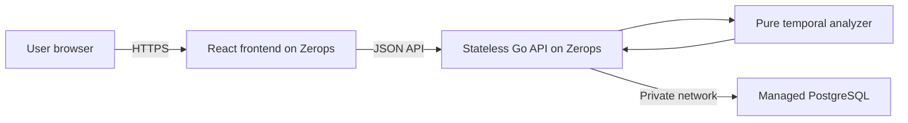

# TimeTrap architecture and frozen MVP scope

## Product definition

TimeTrap is a design-time verifier that finds intervals where cached entitlements, sessions, tokens, or other authorization copies remain valid after their source authorization has been revoked.

## Primary users

- Backend developers
- Authentication and identity developers
- SaaS engineering teams
- Subscription and entitlement-system developers
- Security reviewers

## Secondary users

- Students learning authorization architecture
- Technical interviewers and educators
- Teams reviewing cache and session policies

## Core product promise

TimeTrap turns a hidden timing disagreement into a deterministic counterexample containing:

- Exact violation start
- Exact violation end
- Duration
- Involved objects
- Responsible events
- Failed invariant
- Suggested configuration-level remediation

It verifies a submitted design model. It does not inspect a live application.

## Domain terminology

### Timed object

A simplified authorization-related object whose validity changes over time.

### Event

A state transition applied to one object at a particular integer minute.

### Source

The authoritative object from which another object's legitimacy is derived.

For example, a subscription record can be the source of a cached premium entitlement.

### Dependent

An object that should not remain valid beyond a rule-defined relationship with its source.

### Invariant

A condition expected to remain true throughout the submitted simulation horizon.

### Horizon

The final minute covered by the bounded analysis.

### Counterexample

The earliest reproducible interval during which an invariant fails.

## Supported objects

The MVP supports exactly these object kinds:

| Object | Intended use |
| --- | --- |
| Subscription | Billing or plan source of truth |
| Cached entitlement | Cached authorization or feature access |
| Session | Server-side or logical user session |
| Token | Access, refresh, reset or capability token |
| Invitation | Time-limited invitation |
| Credential | Temporary or revocable credential |

These kinds provide labels and validation context. The core reducer still operates on the same valid/invalid state model.

## Supported events

The MVP supports exactly these event types:

| Event | State effect |
| --- | --- |
| Issue | Makes the object valid |
| Refresh | Makes or keeps the object valid and resets its validity start |
| Revoke | Makes the object invalid |
| Expire | Makes the object invalid |

Every object begins invalid.

Contradictory events on the same object at the same minute are rejected. For example, an object cannot be both issued and revoked at minute 10.

## Temporal semantics

TimeTrap uses the following frozen temporal rules:

| Rule | Meaning |
| --- | --- |
| Time unit | Non-negative integer minute |
| Interval | Half-open: `[start, end)` |
| Event at `t` | Takes effect at minute `t` |
| Issue or refresh at `t` | Object is valid beginning at `t` |
| Revoke or expire at `t` | Object is invalid beginning at `t` |
| Grace deadline | `revokeMinute + graceMinutes` |
| Violation start | Deadline minute, if the dependent remains valid |
| Horizon | Exclusive end of the analyzed interval |
| Ongoing finding | Finding remains active until the horizon |
| Safe | No invariant failed inside the submitted horizon |

### Consequences

- An object issued at minute `0` and expired at minute `60` is valid during `[0, 60)`.
- A cache revoked at minute `10` is invalid beginning at minute `10`.
- An event occurring exactly at the horizon cannot create a positive-duration violation beyond the horizon.
- TimeTrap makes no claim after the configured horizon.

## Frozen invariants

The MVP supports exactly three invariant templates.

### 1. Revoked access must end within a grace period

Configuration:

- Source object
- Dependent object
- Grace duration

Meaning:

When the source is revoked at minute `r`, the dependent must no longer be valid beginning at `r + grace`.

Example:

- Source revoked at minute 10
- Grace duration is 5 minutes
- Dependent remains valid until minute 60
- Violation interval is `[15, 60)`

### 2. A dependent object must not outlive its source

Configuration:

- Source object
- Dependent object

Meaning:

The dependent must not be valid at a minute when its source is invalid.

This invariant has no grace period.

### 3. An object must not exceed maximum validity

Configuration:

- Target object
- Maximum duration

Meaning:

A continuous validity segment beginning with `issue` or `refresh` must not exceed the configured maximum duration.

A refresh begins a new validity segment.

## Analyzer API and execution strategy

### Public API

The analyzer exposes one primary function:

```go
func Analyze(scenario domain.Scenario) (domain.Analysis, error)
```

The function receives a complete domain scenario and returns either:

- A deterministic analysis result, or
- An error when the model cannot be evaluated safely.

The analyzer may call `scenario.Validate()` defensively. It must not assume that every caller has already passed the scenario through the HTTP validation endpoint.

An unsafe scenario is a successful analysis result, not a Go error. The error return is reserved for models that cannot be evaluated reliably.

### Execution flow

```text
Validate defensive assumptions
        ↓
Generate candidate boundaries
        ↓
Sort and deduplicate boundaries
        ↓
Evaluate every segment [boundary[i], boundary[i+1])
        ↓
Reduce object states at the segment start
        ↓
Evaluate every configured invariant
        ↓
Open, continue or close violation intervals
        ↓
Select the earliest violation deterministically
        ↓
Attach deterministic remediation
```

The analyzer evaluates segments between relevant boundaries instead of checking every minute in the horizon.

Candidate boundaries include:

- Minute `0`
- Scenario horizon
- Every event minute
- The minute immediately before an event, when inside the horizon
- The minute immediately after an event, when inside the horizon
- Revocation plus grace duration
- Maximum-validity deadlines
- Expiration boundaries

### Analyzer guarantees

- The submitted scenario is treated as immutable input.
- `Analyze` must not reorder, normalize or otherwise mutate the submitted scenario.
- Any sorting must operate on newly allocated copies.
- The same input must always produce the same result.
- Output ordering must not depend on Go map iteration order.
- Missing or invalid object references produce an error, not a safe result.
- The analyzer does not depend on HTTP, PostgreSQL or display formatting.
- The analyzer makes no claims after the configured horizon.

### Why this API matters

- `domain.Scenario` is the analyzer's input contract.
- `domain.Analysis` is its output contract.
- The error return distinguishes an unsafe model from a model that could not be evaluated.
- Defensive validation protects future callers such as tests, CLI tools or background workers.
- Input immutability makes repeated analyses reproducible.

## Analyzer limitations

- Time uses integer-minute resolution.
- Analysis is bounded by the submitted horizon.
- A safe result applies only to the submitted model.
- Object state is simplified to valid or invalid.
- Events are assumed to occur exactly at their configured minute.
- The analyzer does not model network delay, clock skew or concurrent races.
- Incorrect or incomplete input can produce an irrelevant result.
- An ongoing violation is truncated at the horizon.
- The analyzer does not inspect a live application.

## Canonical demonstration

### Unsafe scenario

| Setting | Value |
| --- | --- |
| Name | Subscription cancellation leak |
| Horizon | 90 minutes |
| Source | Premium subscription |
| Source events | Issue at 0, revoke at 10 |
| Dependent | Premium entitlement cache |
| Dependent events | Issue at 0, expire at 60 |
| Invariant | Revoked access must end within a grace period |
| Grace | 5 minutes |

Expected result:

- Verdict: unsafe
- Source revocation: minute 10
- Permitted deadline: minute 15
- Stale-access interval: `[10, 60)`
- Total stale access: 50 minutes
- Policy-violation interval: `[15, 60)`
- Policy-violation duration: 45 minutes
- Responsible dependent: Premium entitlement cache

# Planned architecture
