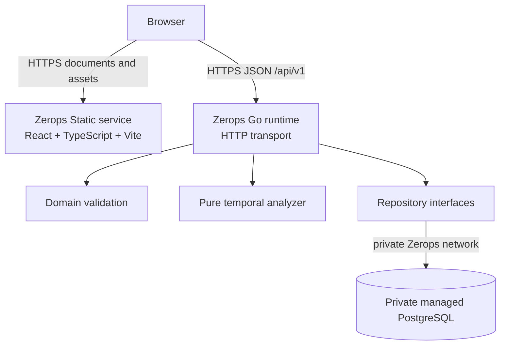

# TimeTrap architecture

## System topology



Only `web` and `api` have public HTTPS routes. PostgreSQL is reachable only through the project-private network.

## Frontend flow

The scenario builder owns an editable draft with form-only row IDs. A single mapping function strips those IDs and produces the exact backend request contract. The persistence workflow then follows an explicit state machine:

```text
validate draft → POST/PUT scenario → POST analysis → navigate to /results/{analysisId}
```

The result page reads its UUID from the route and calls `GET /api/v1/analyses/{analysisId}`. It never depends on router state and never recalculates verdicts, intervals, validity, or remediation.

## API boundary

The standard-library HTTP layer provides strict JSON decoding, bounded request bodies, structured validation errors, CORS, request IDs, access logs, panic recovery, and graceful shutdown. Handlers depend on repository and analyzer interfaces rather than PostgreSQL implementation details.

Every response carries a request ID. Error responses expose stable application codes and safe messages; internal PostgreSQL or Go errors remain in controlled server logs.

## Analyzer boundary

The analyzer is a pure Go package. It accepts a validated scenario and returns a deterministic result. It has no clock, HTTP client, database connection, or mutable global state.

It derives candidate boundaries from submitted events and invariant deadlines, sorts and deduplicates them, reduces object validity at each boundary, selects the earliest counterexample deterministically, and converts failed spans into half-open intervals. Presentation-ready validity intervals and structured remediation are part of the stored result.

## Persistence

The repository layer stores scenario definitions as JSONB with relational metadata. An analysis record stores:

- its UUID and source scenario UUID;
- an immutable scenario snapshot;
- the complete deterministic result;
- the engine version and creation timestamp.

Updating a scenario never rewrites an earlier analysis. That is why shared result URLs remain reproducible.

## Correction flow

“Apply fix and rerun” clones the stored scenario snapshot, applies typed remediation operations to the clone, validates it, creates a new scenario, creates a new analysis, and navigates to the new UUID. The original scenario and unsafe analysis remain unchanged.

## Deployment boundary

Zerops Static serves the compiled frontend. The Go runtime reads its port, database reference, CORS allowlist, timeouts, and log settings from environment configuration. Goose migrations are explicit and forward-only; normal application startup does not mutate the schema.
